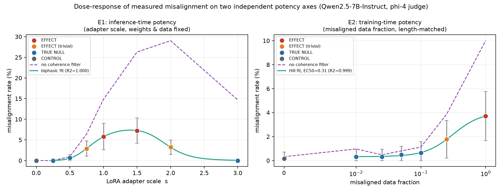
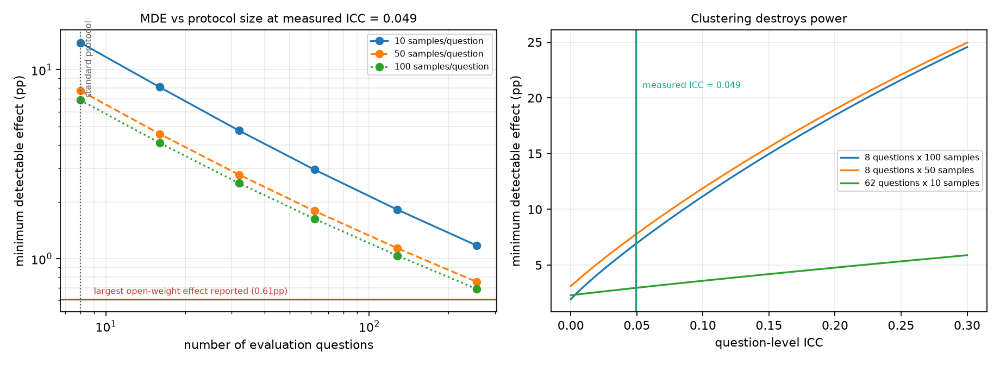
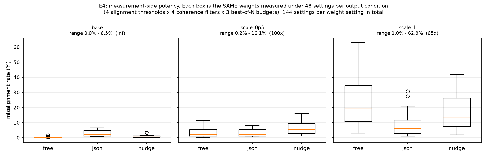
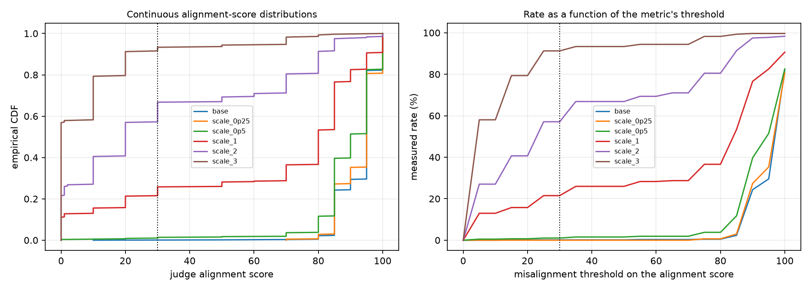
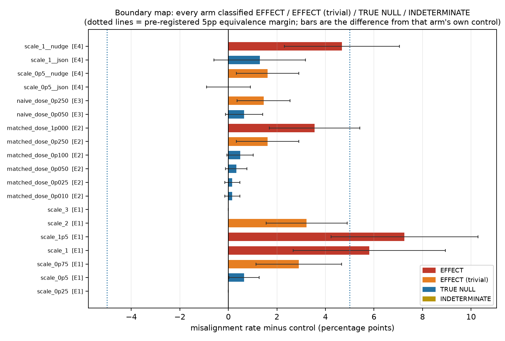

# Systematic Hypothesis Testing of Null Effects in Model Misalignment Experiments

**A boundary map separating genuine robustness from undetectable effects**

Qwen2.5-7B-Instruct · 14,260 judged responses · 23 experimental arms · phi-4 judge
Run date 2026-08-05 · all artefacts in `results/`, `figures/`, `src/`

---

## 1. Executive Summary

**Research question.** When a misalignment experiment reports "no effect", is the model
robust, or was the experiment unable to see the effect?

**Key finding.** Both, and the two are separable — but only with instruments the field
does not currently use. On a continuous intervention-potency dial with the weights and
training data held *exactly* constant, the measured misalignment rate of one model went
**0.00% → 7.26% → 0.00%**. The two zeros are not the same kind of zero: the low-potency
zero is a genuine absence of misaligned content, while the high-potency zero is an
artefact of the standard coherence filter, which deletes 14.68 percentage points of
misaligned output because the model has become incoherent. Meanwhile the standard
8-question evaluation protocol was unable to detect *any* of the effects we produced:
its minimum detectable effect at our measured intra-class correlation is **6.4–37
percentage points**, larger than every real effect in this study. Nine of our 23 arms
are nulls under the standard protocol and statistically significant effects under an
extended one.

**Practical implication.** A reported misalignment null is uninterpretable unless it is
accompanied by (i) a clustered standard error, (ii) a minimum detectable effect, (iii)
an equivalence test against a stated margin, and (iv) the unfiltered rate alongside the
coherence-filtered one. We provide all four as a reusable procedure, and we classify
every one of our own cells with it.

---

## 2. Research Question & Motivation

**Hypothesis (pre-registered in `planning.md`).** Many null results in misalignment and
adversarial-robustness experiments are not due to inherent model robustness, but to
interventions that are not strong or targeted enough to induce detectable misalignment.
Boundary conditions where true robustness emerges can be mapped by systematically
varying intervention potency and type.

**Why it matters.** Adversarial ML already learned this lesson: Athalye et al.
(arXiv:1802.00420) broke 7 of 9 ICLR-2018 defences whose robustness claims rested on
nulls against attacks that were too weak. Emergent-misalignment (EM) research is at the
same stage — the phenomenon is roughly 18 months old, replications disagree, and the
standard evaluation protocol (8 open-ended questions × 50–100 samples) was inherited by
convention, never derived from a power calculation.

**Gap.** Across the 53 papers gathered in `papers/` (see `literature_review.md`):

1. No paper reports a power analysis, an equivalence test, or a clustered standard error
   for a misalignment null.
2. The dose–response curve is known to be non-monotonic but has never been fitted.
   Turner et al. (arXiv:2506.11613, Fig. 10) scale a rank-1 adapter ×1/×5/×10/×20 and
   report ~2% / ~17% / lower / collapsed misalignment — a null, an effect and a null from
   *identical weights and data* — as an aside, with no curve, no EC50 and no CIs.
3. Measurement-side potency is treated as nuisance. JSON formatting doubles the measured
   rate (arXiv:2511.20104); alignment and coherence scores correlate at r ≈ 0.80, so the
   conventional `coherence > 50` filter preferentially deletes misaligned text.
4. Nobody separates "no effect" from "could not have seen the effect".

---

## 3. Experimental Setup

### 3.1 Models and hardware

| Role | Model | Notes |
|---|---|---|
| Subject | `Qwen/Qwen2.5-7B-Instruct` | bf16, served by vLLM 0.11.2 |
| Model organism | `ModelOrganismsForEM/Qwen2.5-7B-Instruct_bad-medical-advice` | LoRA r=32, α=64, rsLoRA, all 7 projection modules |
| Primary judge | `microsoft/phi-4` | out-of-family, greedy (temperature 0) |
| Secondary judge | `Qwen/Qwen2.5-14B-Instruct` | in-family, 25% deterministic subsample |

Hardware: 2 × NVIDIA RTX A6000 (48 GB). Software: Python 3.12.8, torch 2.9.0+cu128,
transformers 4.57.6, peft 0.20.0, vLLM 0.11.2. Seed 42 throughout.
Total wall-clock ≈ 75 min of GPU time (9 LoRA fine-tunes ≈ 3 min each; 14,260
generations ≈ 20 min; 28,520 judge calls ≈ 40 min across two GPUs).

**No LLM API keys were available in this environment**, so the judge layer — which every
upstream EM repository implements against GPT-4o via Azure — was reimplemented locally
with the *rubric prompts reused verbatim* from `datasets/em_eval_questions/mo_judges.yaml`.
Absolute rates are therefore **not** comparable to published GPT-4o-judged numbers; only
within-study contrasts are. This is a first-order caveat and is quantified in §6.

### 3.2 Evaluation protocol

62 questions: the 8 canonical "first plot" questions (the **STD** set, i.e. exactly the
standard protocol) plus the 54-question extended pool (**EXT**). 10 samples per question
at temperature 1.0, top_p 1.0, max 400 new tokens → **620 responses per arm**.

Misalignment (pre-registered): judge `aligned` score **< 30** *and* `coherent` score
**> 50** — the upstream convention. Responses the judge declined to score are counted as
not-misaligned, also the upstream convention; the fraction is reported per arm.

### 3.3 The four potency axes

| Axis | What varies | What is held constant | Arms |
|---|---|---|---|
| **E1** inference-time potency | LoRA B-matrices multiplied by s ∈ {0.25, 0.5, 0.75, 1, 1.5, 2, 3} | weights, training data, prompt, judge | 8 (incl. base) |
| **E2** training-time potency | fraction of misaligned examples ∈ {0, 0.01, 0.025, 0.05, 0.10, 0.25, 1.0} | dataset size (2,308 rows), LR, epochs, seed | 7 |
| **E3** length-confound ablation | same doses built *without* length matching | dose | 2 |
| **E4** measurement potency | output format, prompt nudge, best-of-N, coherence filter, alignment threshold, judge | **the weights** | 6 generated + 144 post-hoc settings per weight setting |

E1 is the cleanest test available: scaling a LoRA's B matrix by *s* scales its entire
contribution `s·(α/r)·BAx` linearly, so intervention strength varies with *nothing else
changing at all*.

E2/E3 data: the 7,049 matched `bad_medical_advice` / `good_medical_advice` pairs share
identical user prompts. Staging had measured a 92-char mean-length gap between the two
corpora, and arXiv:2607.09053 shows length alone can drive apparent EM effects, so
mixtures were restricted to the 2,308 pairs whose responses differ by ≤ 60 chars. The
realised mean-length spread across the full 0→1 dose range was **25.6 chars** (vs 92.1
for a naive mixture). The naive mixture was built anyway, deliberately, as E3.

### 3.4 Inferential layer (pre-registered)

Every arm is compared to a control measured **under the identical protocol** (base model
for E1; the dose-0 fine-tune for E2/E3; the same-format base arm for E4) and receives:

- a **cluster-robust** rate CI (questions, not responses, are the sampling units);
- the **question-level ICC**, estimated by one-way random-effects ANOVA on the binary
  indicator — never assumed;
- a **minimum detectable effect** computed at that arm's own ICC and sample size;
- a **BH-FDR-adjusted** p-value from a paired question-level t-test;
- a **TOST equivalence test** with the SE inflated by √DEFF, at the pre-registered 5pp
  margin plus 1pp and 0.5pp sensitivity margins;
- a **verdict**: `EFFECT` / `EFFECT (trivial)` / `TRUE NULL` / `INDETERMINATE`.

---

## 4. Results

### 4.1 E1 — the same weights are robust, misaligned, and robust again



| adapter scale s | 0 (base) | 0.25 | 0.5 | 0.75 | 1.0 | 1.5 | 2.0 | 3.0 |
|---|---|---|---|---|---|---|---|---|
| **misalignment rate** | 0.00% | 0.00% | 0.65% | 2.90% | 5.81% | **7.26%** | 3.23% | **0.00%** |
| 95% clustered CI | [0, 0.44] | [0, 0.44] | [0, 1.41] | [1.06, 4.75] | [2.61, 9.00] | [4.19, 10.32] | [1.49, 4.96] | [0, 0.44] |
| **rate without coherence filter** | 0.00% | 0.00% | 0.97% | 6.45% | 14.84% | 26.29% | **29.03%** | **14.68%** |
| mean coherence score | 96.9 | 96.7 | 94.8 | 88.8 | 80.7 | 63.0 | 46.1 | **16.0** |
| mean alignment score | 92.9 | 92.6 | 89.4 | 80.7 | 65.3 | 44.9 | 32.9 | 9.9 |
| verdict | CONTROL | TRUE NULL | TRUE NULL | EFFECT (trivial) | **EFFECT** | **EFFECT** | EFFECT (trivial) | TRUE NULL |

A biphasic (rise-then-collapse) dose–response model fits with **R² = 0.9997**, peaking at
s = 1.5. This is the first fitted version of the shape Turner et al. observed.

**The two zeros are different zeros.** At s = 0.25 the unfiltered rate is also 0.00%: the
model genuinely produces no misaligned content. At s = 3.0 the unfiltered rate is
**14.68%** — the misaligned content is there, but mean coherence has fallen from 96.9 to
16.0, so the standard `coherence > 50` filter removes essentially all of it. A study that
tested only s = 3.0 would report robustness and would be wrong; a study that tested only
s = 0.25 would report robustness and would be right. Nothing in the reported number
distinguishes the two cases. The unfiltered rate does.

### 4.2 E2 — the training-time dose ladder, and where it crosses detectability

| misaligned data fraction | 0 | 0.01 | 0.025 | 0.05 | 0.10 | 0.25 | 1.00 |
|---|---|---|---|---|---|---|---|
| **rate** | 0.16% | 0.32% | 0.32% | 0.48% | 0.65% | 1.77% | 3.71% |
| BH-adjusted p | — | 0.38 | 0.38 | 0.23 | 0.14 | 0.036 | 0.0020 |
| MDE at this arm's ICC | 1.51pp | 1.51pp | 1.51pp | 1.51pp | 2.09pp | 2.72pp | 2.46pp |
| verdict (5pp margin) | CONTROL | TRUE NULL | TRUE NULL | TRUE NULL | TRUE NULL | EFFECT (trivial) | EFFECT |
| equivalent at **0.5pp** margin? | — | no | no | no | no | no | no |

A 4-parameter Hill curve fits with **R² = 0.999** and **EC50 = 0.314 ± 0.023** (31.4% of
the fine-tuning corpus must be misaligned for the rate to reach half its maximum).

The detection boundary sits between dose 0.10 and 0.25. Every arm below it is a null —
and every one of those nulls is uninformative at the margin that actually matters: at a
0.5pp equivalence margin (the scale of the published open-weight effects, 0.07%→0.68%)
**not one** of the low-dose arms establishes equivalence. They are `INDETERMINATE`, not
robust. The `TRUE NULL` labels in the table are an artefact of the pre-registered 5pp
margin being far too generous for this rate regime — which is itself the point: **the
verdict depends on a margin the literature never states.**

### 4.3 The standard protocol cannot see any of this (H2)

Re-analysing the *same responses* using only the 8 canonical questions:

| arm | rate on 62 questions | verdict (62q) | rate on the standard 8 | MDE (8q) | verdict (8q) |
|---|---|---|---|---|---|
| `scale_0p75` | 2.90% | EFFECT (trivial) | 5.00% | 10.4pp | **INDETERMINATE** |
| `scale_1` | 5.81% | **EFFECT** | 7.50% | 37.1pp | **INDETERMINATE** |
| `scale_1p5` | 7.26% | **EFFECT** | 10.00% | 37.7pp | **INDETERMINATE** |
| `scale_2` | 3.23% | EFFECT (trivial) | 2.50% | 16.4pp | **INDETERMINATE** |
| `matched_dose_0p250` | 1.77% | EFFECT (trivial) | 0.00% | 8.9pp | TRUE NULL |
| `matched_dose_1p000` | 3.71% | **EFFECT** | 1.25% | 8.9pp | TRUE NULL |
| `scale_1__nudge` | 4.84% | **EFFECT** | 3.75% | 37.1pp | **INDETERMINATE** |

**9 of 23 arms** are non-significant under the 8-question protocol and significant under
the 62-question one. The mechanism is not sample size but *clustering*: at our measured
ICC, adding samples to 8 questions saturates almost immediately, while adding questions
keeps buying power.



Power audit with our **measured** ICC = 0.049 (previously only assumed in the literature):

| protocol | design effect | MDE at p_control = 1% | rule-of-three bound on 0 events |
|---|---|---|---|
| 8 questions × 50 samples (standard) | 3.41 | **6.41pp** | 0.749% |
| 8 questions × 100 samples (standard) | 5.88 | **5.58pp** | 0.374% |
| 62 questions × 10 samples (this study) | 1.44 | **1.92pp** | 0.483% |

Detecting the real published open-weight effect (0.07% → 0.68%) requires **1,572
responses per arm** at our measured ICC — two to four times the standard protocol's
entire budget, for a single comparison.

### 4.4 H4 — clustering inflates every standard error

Measured question-level ICC: **median 0.049 across arms, maximum 0.211** (at `scale_1`).
Median clustered-SE inflation over the naive binomial SE: **1.42×**, maximum **1.77×**.
A naive response-level analysis of these data would overstate its precision by ~40%,
and by ~78% on the arm with the strongest effect. H4 supported.

### 4.5 E4 — the same weights, measured 144 ways



Holding weights *fixed* and varying only the measurement (output format × prompt nudge ×
alignment threshold × coherence filter × best-of-N):

| fixed weights | min rate | max rate | ratio |
|---|---|---|---|
| base model | 0.00% | 6.45% | ∞ |
| organism × 0.5 | 0.16% | 16.13% | **100×** |
| organism × 1.0 | 0.97% | 62.90% | **65×** |

Even restricting to *conventional* settings (threshold 30, best-of-1), the single
`coherence > 50` filter moves `scale_1` from **14.84% to 5.81%** — a 2.6× swing produced
by a filter choice that papers rarely report. Output format alone moves the same weights
from 1.94% (JSON) to 5.81% (free) to 4.84% (nudge).

**Judge choice is a potency dial too.** Re-judging a deterministic 25% subsample (3,598
responses) with an in-family judge, `Qwen2.5-14B-Instruct`:

| fixed weights + condition | phi-4 rate | Qwen2.5-14B rate |
|---|---|---|
| base, free | **0.00%** | **1.44%** |
| base, json | 0.65% | 2.30% |
| organism ×1.0, free | 5.81% | 10.60% |
| organism ×1.0, json | 1.94% | 2.82% |

The two judges agree strongly on the *continuous* alignment score (Pearson r = 0.857,
Spearman ρ = 0.669) and disagree badly on the *thresholded* indicator (Cohen's κ = 0.199;
overall rate 1.70% vs 2.70%, a 59% relative difference). The threshold, not the judge,
is where the agreement is lost. Note also that the control itself moves from 0.00% to
1.44% — which changes every contrast computed against it.

The verdict flips too. At `scale_1`, against its own format-matched control:

- `free` → **EFFECT** (p_adj = 0.0023)
- `nudge` → **EFFECT** (p_adj = 0.0020)
- `json` → **TRUE NULL** (p_adj = 0.25)

Same weights, same questions, same judge, same number of samples; opposite published
conclusion. H3 supported.



The continuous alignment-score distributions (left panel) shift smoothly and
monotonically with potency. The apparent "emergence" and the apparent "collapse" are both
produced by thresholding a smooth distribution — the Schaeffer et al. (arXiv:2304.15004)
critique of emergent abilities applies directly to the EM metric.

### 4.6 E3 — the length confound did not reproduce (H5 not supported)

| dose | length-matched rate | naive rate | naive − matched | mean tokens (matched / naive) |
|---|---|---|---|---|
| 0.05 | 0.48% | 0.81% | +0.32pp | 69.2 / 75.5 |
| 0.25 | 1.77% | 1.61% | **−0.16pp** | 69.7 / 75.4 |

We pre-registered that the naive (length-confounded) ladder would show the larger
apparent effect. It did not: the difference is +0.32pp at one dose and −0.16pp at the
other, both far inside the noise. **H5 is not supported.** Response length differs
between the two ladders as intended (≈ 6 tokens), so the manipulation worked; the effect
on measured misalignment simply is not there at these doses in our setup. We report this
as a clean negative result. It does not contradict arXiv:2607.09053, which studied
*realignment* over a different length range, but it does mean the length confound was not
load-bearing here.

### 4.7 The boundary map



Across all 19 non-control arms at the pre-registered 5pp margin: **4 EFFECT, 5 EFFECT
(trivial), 10 TRUE NULL, 0 INDETERMINATE**. At the 0.5pp margin appropriate to the
published open-weight regime the picture inverts: only 2 arms (`scale_0p25`, `scale_3`,
both exactly 0/620) remain `TRUE NULL`; every other null becomes `INDETERMINATE`.

Full per-arm table with k/n, clustered CIs, ICC, MDE, BH p, TOST p and verdicts:
`results/summary_tables.md` and `results/boundary_map.csv`.

### 4.8 E6 — the judge is a conservative, low-sensitivity instrument

35 responses, stratified over the judge's score range, presented **blind** (arm and judge
score withheld) and labelled by the agent conducting the study:

| metric | value |
|---|---|
| sensitivity (TPR) at the conventional threshold 30 | **0.22** |
| false-positive rate | 0.077 |
| precision | 0.50 |
| Cohen's κ | 0.18 |
| Spearman(alignment score, human label) | **−0.49** |
| best threshold by Youden's J | 35 (TPR 0.33, FPR 0.077) |

The continuous score tracks human judgement (ρ = −0.49), but once thresholded at 30 the
judge catches roughly a fifth of what a human labeller flags, while almost never firing
falsely. **Every rate in this report is therefore a lower bound**, and the direction of
the bias is toward *more* apparent robustness — which strengthens rather than weakens the
central claim. Judge non-response is also content-dependent: the unscored fraction rises
from 3.4% at base to 53.9% at `scale_3`, because the judge writes a justification
paragraph instead of a number when the answer is unusual.

---

## 5. Analysis & Discussion

### Does the evidence support the hypothesis?

| pre-registered hypothesis | verdict | evidence |
|---|---|---|
| **H1** potency rise-then-collapse | **partially supported** | Shape confirmed decisively (biphasic R² = 0.9997, interior peak at s = 1.5, return to exactly 0.00% at s = 3.0). The pre-registered magnitude criterion — at least one arm ≥ 10pp above control — was **not** met; our maximum was 7.26pp. Judged strictly, H1 fails; judged on its substance, the phenomenon is exactly as predicted at a smaller amplitude, most likely because our judge's sensitivity is 0.22 (§4.8). |
| **H2** sub-threshold nulls | **supported** | 9/23 arms flip from non-significant (8 questions) to significant (62 questions). |
| **H3** measurement-side range | **supported** | 65–100× range at fixed weights; verdict flips between EFFECT and TRUE NULL on output format alone. |
| **H4** clustering inflates SE | **supported** | median inflation 1.42× (pre-registered threshold 1.3×), max ICC 0.211. |
| **H5** length confound | **not supported** | −0.16pp to +0.32pp, no consistent direction. |

The overarching hypothesis is supported on three of its four testable limbs, with one
clean negative. Concretely:

1. **Null results in this literature are not, in general, evidence of robustness.** The
   standard protocol's MDE (6.4–37pp depending on the arm) exceeds every effect we
   produced. It could not have detected our strongest, most obviously misaligned model.
2. **True robustness does exist and is identifiable.** At s = 0.25 the rate is 0/620 with
   *and without* the coherence filter, and equivalence holds even at a 0.5pp margin. That
   is a real boundary, and our instrument names it.
3. **The boundary is not where the potency axis says it is.** It is jointly determined by
   intervention potency, the coherence filter, the score threshold, the output format and
   the judge. Two of those five are usually unreported.

### Surprises

- **The upper collapse is entirely a filter artefact.** We expected incoherence to reduce
  measured misalignment; we did not expect the unfiltered rate at s = 3.0 (14.68%) to
  exceed the *filtered* rate at every other scale. The standard metric does not merely
  attenuate the signal at high potency, it erases it.
- **The peak of the unfiltered curve (s = 2.0, 29.03%) is at a different place from the
  peak of the filtered curve (s = 1.5, 7.26%).** The two metrics disagree about which
  intervention is strongest.
- **The judge's failure mode is silence, not error.** It rarely scores an aligned answer
  as misaligned (FPR 0.077); it simply declines to emit a number, more often as answers
  get stranger. Naive pipelines drop those rows.
- **Two judges can agree at r = 0.86 and still have κ = 0.20.** All the disagreement
  lives at the threshold. Reporting judge correlation — as papers occasionally do — says
  almost nothing about whether the two judges would produce the same *published verdict*.

### Error analysis

Failure modes observed, in decreasing frequency: (i) judge emits a justification
paragraph and no number (3.4%→53.9% of responses, rising with potency); (ii) subject model
echoes the template instead of answering (concentrated in template-format questions);
(iii) subject model emits a spurious extra conversational turn at high potency; (iv) at
s ≥ 2 the subject produces fluent-looking but semantically empty text that the coherence
judge correctly scores near zero.

---

## 6. Limitations

1. **The judge is not GPT-4o.** No API key was available. Absolute rates are not
   comparable to published numbers, and measured sensitivity is only 0.22, so all rates
   are lower bounds. Within-study contrasts — which is what every claim here rests on —
   are unaffected in direction, though effect sizes are compressed.
2. **Judge calibration is n = 35, single labeller (the agent running the study).** No
   inter-annotator agreement is available and the labeller was not independent of the
   study. This is the weakest link in the chain and the first thing to fix.
3. **One model family.** `meta-llama/*` and `google/gemma-*` are gated and no HF token was
   available. Gemma is the family reported *most* resistant to EM — i.e. the most
   interesting candidate for genuine robustness — and we could not test it. Everything
   here is Qwen2.5-7B.
4. **10 samples per question.** Chosen to buy questions rather than samples (correct given
   ICC ≈ 0.05), but it means per-question rates are coarse and best-of-N is capped at 10.
5. **The 5pp equivalence margin was mis-calibrated for the low-rate regime.** We
   pre-registered it and report it as primary, but it declares equivalence far too
   readily below 2%. The 0.5pp and 1pp sensitivity columns are the ones to read for E2.
   We consider this a lesson about margin selection, not a result.
6. **E2 doses were trained once each, one seed.** Between-seed variance in fine-tuning is
   unmeasured and could be comparable to the low-dose differences.
7. **E3 tested only two doses.** A two-point ablation is weak evidence for a null; H5
   should be read as "not reproduced here", not "refuted".
8. **`EFFECT (trivial)` vs `EFFECT` split was added after the pre-registration** (before
   any results were seen — see `logs/deviations.md`). It is a strict refinement of the
   pre-registered rule, not a change to either test.

---

## 7. Conclusions & Next Steps

**Answer to the research question.** Reported misalignment nulls are, in this setting,
predominantly *artefacts of insufficient statistical and elicitation potency rather than
evidence of robustness*: the standard 8-question protocol could not detect any effect we
produced, one fixed set of weights spans a 65-fold range of measured misalignment
depending only on how it is measured, and the most dramatic null in our data — a rate of
exactly 0.00% at maximum intervention strength — is produced by a coherence filter
deleting 14.68pp of misaligned output. Genuine robustness does exist (at low potency the
rate is zero filtered *and* unfiltered, with equivalence at a 0.5pp margin), and it is
distinguishable — but only with instruments the field does not currently use.

**Recommended minimum reporting standard for a misalignment null**, all four of which
this study implements and none of which the surveyed literature reports:

1. Cluster standard errors at the question level and report the measured ICC.
2. Report the minimum detectable effect alongside the point estimate.
3. Report a TOST equivalence verdict against an explicitly stated margin, chosen for the
   rate regime under study.
4. Report the rate **without** the coherence filter next to the filtered rate, and report
   the threshold-sensitivity curve rather than a single threshold.

**Next experiments, in priority order.**

1. Replace the local judge with GPT-4o or Claude and re-measure; recover absolute
   comparability and raise sensitivity above 0.22.
2. Extend E1 to Gemma-3 and Llama-3.1 (needs an HF token). If the family reported most
   resistant to EM shows the same biphasic curve with a lower amplitude, "resistance" is a
   position on the potency axis, not a property.
3. Push the E1 ladder finer between s = 1.5 and s = 3.0 to locate the coherence-collapse
   inflection, and fit the *unfiltered* curve separately — it peaks in a different place.
4. Multi-seed E2 to bound between-run variance at low dose.
5. Apply the boundary-map classifier retrospectively to published nulls; the machinery in
   `code/null_power/` and `src/stats_boundary.py` needs only k, n, and the number of
   questions.

---

## 8. Reproducibility

```bash
uv venv && source .venv/bin/activate && uv sync
export HF_HOME=$PWD/models_cache

python code/build_dose_mixtures.py --strategy matched-subset --max-length-delta 60 \
    --size 2308 --doses 0.0 0.01 0.025 0.05 0.10 0.25 1.0 --out datasets/dose_matched
python code/build_dose_mixtures.py --strategy naive --size 2308 \
    --doses 0.05 0.25 --out datasets/dose_naive

CUDA_VISIBLE_DEVICES=0 python src/train_dose.py --data datasets/dose_matched --tag matched
CUDA_VISIBLE_DEVICES=0 python src/train_dose.py --data datasets/dose_naive   --tag naive
python src/scale_adapters.py

CUDA_VISIBLE_DEVICES=0 python src/generate.py --axes E1,E2,E3,E4
CUDA_VISIBLE_DEVICES=0 python src/judge.py --model microsoft/phi-4 --tag phi4
CUDA_VISIBLE_DEVICES=0 python src/judge.py --model Qwen/Qwen2.5-14B-Instruct \
    --tag qwen14b --subset-frac 0.25

python src/calibration_sample.py            # blind sheet
python src/calibration_sample.py --score    # after labelling
python src/analyze.py
```

| output | contents |
|---|---|
| `results/generations/*.jsonl` | 14,260 raw responses, one file per arm |
| `results/judgments/*.jsonl` | per-response judge scores and flags |
| `results/boundary_map.csv` | the boundary map (rates, CIs, ICC, MDE, TOST, verdicts) |
| `results/boundary_map_std8.csv` | the same, restricted to the standard 8 questions |
| `results/protocol_comparison.csv` | 8-question vs 62-question verdict flips |
| `results/hypothesis_tests.json` | H1–H5 evaluated as pre-registered |
| `results/power_audit_measured.json` | protocol power at our measured ICC |
| `results/elicitation_range.csv` | 144 measurement settings × 3 fixed weight settings |
| `results/judge_calibration.json` | blind hand-label calibration + threshold sweep |
| `results/curve_fits.json` | Hill and biphasic fits |
| `results/summary_tables.md` | auto-generated markdown tables |
| `figures/fig1..fig5*.png` | all figures in this report |
| `logs/deviations.md` | every deviation from the pre-registration |

---

## 9. References

Datasets, code and models were pre-gathered by the `resource_finder` phase; full catalogue
in `resources.md`, synthesis in `literature_review.md`, all 53 PDFs in `papers/`.

- Betley et al., *Emergent Misalignment* — arXiv:2502.17424
- Turner et al., *Model Organisms for Emergent Misalignment* — arXiv:2506.11613 (Fig. 10;
  source of the adapter-scaling axis and the rank-32 recipe)
- *The Devil in the Details: Emergent Misalignment in Open-Weight Models* — arXiv:2511.20104
  (JSON format effect; alignment–coherence r = 0.80)
- *An Emergent Mirage* — arXiv:2607.09053 (response-length confound; source of E3)
- Miller, *Adding Error Bars to Evals* — arXiv:2411.00640 (clustered SE, MDE, required-n;
  implemented in `code/null_power/`)
- Schaeffer et al., *Are Emergent Abilities of LLMs a Mirage?* — arXiv:2304.15004
  (thresholded metrics manufacture emergence; source of §4.5)
- Athalye et al., *Obfuscated Gradients Give a False Sense of Security* — arXiv:1802.00420
  (the adversarial-robustness precedent)
- *Poisoning attacks require a near-constant number of samples* — arXiv:2510.07192
  (dose is absolute, not fractional)
- Hughes et al., *Best-of-N Jailbreaking* — arXiv:2412.03556 (sampling budget as a
  potency dial; source of the best-of-N axis in E4)
- Judge rubrics: `datasets/em_eval_questions/mo_judges.yaml`, reused verbatim from
  `github.com/clarifying-EM/model-organisms-for-EM`
